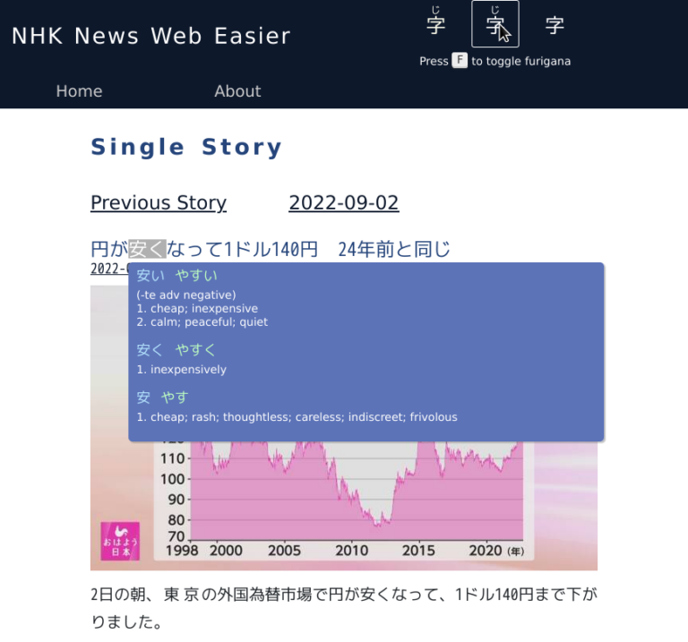

# NHKEasier.com

Learner friendly interface for NHK News Web Easy

News Web Easy is a Japanese news website targeted at Japanese children.
The short articles and the simple sentence structures make is a good candidate to practice Japanese as a beginner.
[NHK Easier](https://nhkeasier.com/) improves the experience for foreign Japanese learners.
In particular, it hides furigana and provides a handy dictionary when hovering or tapping words.

